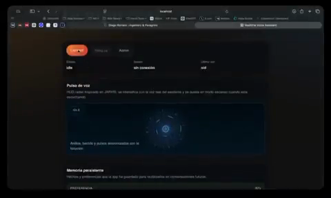

# Realtime Voice Assistant

Lightweight proof of concept for a real-time voice assistant built on `gpt-realtime-1.5`.

## Demo

[](./media/realtime-voice-assistant-demo.mp4)

[Open the demo video directly](./media/realtime-voice-assistant-demo.mp4)

## Stack

- `Node 24`
- `TypeScript`
- `Vite`
- Browser-to-OpenAI `WebRTC`
- Local `SQLite` via `node:sqlite` for lightweight persistent memory
- `Docker` for local and production runtime

## What It Does

- Serves a static web app with a visible transcript.
- Can require an app-level login screen backed by an `HttpOnly` session cookie.
- Exposes `POST /api/realtime/token` to mint short-lived realtime `client_secret` credentials.
- Extracts lightweight persistent memory in the background with `gpt-5-mini`.
- Runs web searches only when the Realtime model asks for them, using a `Responses API` sidecar with `gpt-5-nano`.
- Loads persistent memory into new sessions as hidden user context rather than system instructions.
- Exposes `POST /api/memory/ingest` and `POST /api/memory/reset`.
- Does not relay audio through your own backend.
- Includes rate limiting, short-lived ephemeral tokens, and optional Cloudflare Turnstile support.

## Configuration

Runtime configuration is split across two places:

- secrets and credentials in `.env`
- non-sensitive runtime settings in [app.config.json](./app.config.json)

### `.env`

Keep only secrets here:

- `OPENAI_API_KEY`
- `APP_LOGIN_PASSWORD_HASH`
- `APP_SESSION_SECRET`
- `MEMORY_ADMIN_TOKEN`
- `ADMIN_SESSION_SECRET`
- `TURNSTILE_SECRET_KEY`

The minimal example is in [.env.example](./.env.example).
If you use infrastructure or tooling credentials, keep them outside this repo or in a dedicated secrets manager.

### `app.config.json`

Keep all non-sensitive settings here:

- internal port and host
- Realtime model, voice, and instructions
- rate limits and TTLs
- allowed origins
- proxy trust settings
- login, memory, and web search feature flags
- SQLite path
- `TURNSTILE_SITE_KEY`

## Run Locally

```bash
cp .env.example .env
```

Set at least:

```bash
OPENAI_API_KEY=...
```

Then run:

```bash
docker compose up --build
```

Open `http://localhost:3001`.
If you want a different external port, set `APP_PORT`.
If you change `APP_PORT`, update `realtime.allowedOrigins` in [app.config.json](./app.config.json) as well.

Persistent memory is stored in a Docker volume named `memory-data`.
If you define `MEMORY_ADMIN_TOKEN`, the UI shows an `Admin` button that can open or close an admin session and enable `Reset memory`.
If you enable `webSearch.enabled`, the assistant can verify recent information using its own tool and a fast cached sidecar search.

## Proxy And Headers

By default, the app does not trust `X-Forwarded-For` or `X-Forwarded-Proto`. This avoids making rate limiting and the cookie `Secure` flag depend on spoofable headers when traffic can hit the origin directly.

Enable trusted proxy headers only if the container is exposed exclusively behind a trusted proxy:

- `proxy.trustHeaders=true`
- `proxy.ipHeader="cf-connecting-ip"` if traffic comes through Cloudflare
- `proxy.ipHeader="x-forwarded-for"` only if Traefik or your proxy sanitizes that header and the origin is not publicly exposed

If you expose the server IP directly in addition to the proxy, switch back to `proxy.trustHeaders=false`.

## App Login

If you plan to publish this behind Hetzner and Cloudflare, enable the app-level access gate:

- `appLogin.enabled=true` in [app.config.json](./app.config.json)
- `APP_LOGIN_PASSWORD_HASH` using the format `scrypt$<saltBase64>$<derivedKeyBase64>`
- `APP_SESSION_SECRET` set to a separate secret used to sign the session cookie

Quick example for generating the password hash:

```bash
node -e 'const { randomBytes, scryptSync } = require("node:crypto"); const password = process.argv[1]; const salt = randomBytes(16); const hash = scryptSync(password, salt, 64); console.log(`scrypt$${salt.toString("base64")}$${hash.toString("base64")}`);' "change-this-password"
```

The app login:

- blocks the UI until a valid session exists
- protects `POST /api/realtime/token`, memory endpoints, tools, and the admin session
- uses an `HttpOnly`, `SameSite=Strict` cookie and adds `Secure` automatically when the request arrives over HTTPS or `x-forwarded-proto=https`
- applies its own rate limiting for login attempts

## Included Hardening

- The OpenAI API key never leaves the server.
- General app access can be protected by an `scrypt` password hash.
- Ephemeral `client_secret` credentials have a short TTL.
- The token endpoint is rate-limited by client IP.
- Upstream errors are not returned in full to the browser.
- Allowed origins are enforced through `realtime.allowedOrigins`.
- The app sends a `Content-Security-Policy` header to reduce the impact of XSS and unexpected third-party loads.
- If Cloudflare Turnstile is configured, token issuance requires human verification.
- Persistent memory reset requires `MEMORY_ADMIN_TOKEN`.
- The UI uses a separate admin `HttpOnly` session cookie to enable destructive admin actions in the browser.
- The memory extractor uses a conservative policy and drops sensitive or low-confidence data.
- Persistent memory is injected into Realtime as a `conversation.item.create` with role `user`, avoiding the mix of user-derived content into `instructions`.
- Web search stays out of the voice critical path: Realtime only decides when to use it, and the backend resolves it separately with `gpt-5-nano` plus caching.

## Local Build Without Docker

```bash
npm install
npm run build
npm start
```

## Deploying On Hetzner

The app is designed to ship as a single Docker image. To publish it behind Traefik and Cloudflare:

Before going live, review [PRE-DEPLOY.md](./PRE-DEPLOY.md).

1. Build and publish an image reachable from Hetzner.
2. Deploy the container on a host behind Traefik, pointing traffic to internal port `3000`.
3. Restrict `realtime.allowedOrigins` to the final public domain.
4. If you trust proxy headers, set `proxy.trustHeaders=true` and the correct `proxy.ipHeader`.
5. If you enable app login or Turnstile, define the required secrets in `.env` before deployment.

This repo does not include provider-specific deployment automation.

## License

This project is published under [Apache License 2.0](./LICENSE).
